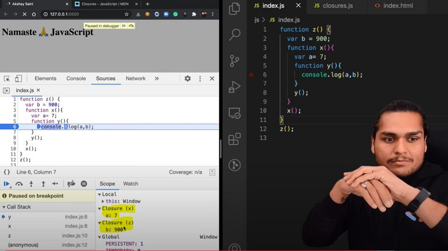

# Episode 10 : Closures in JS

- Function bundled along with it's lexical scope is **closure**.

- JavaScript has a lexcial scope environment. If a function needs to access a variable, it first goes to its local memory. When it does not find it there, it goes to the memory of its lexical parent. See Below code, Over here function **y** along with its lexical scope i.e. (function x) would be called a closure.

  ```js
  function x() {
    var a = 7;
    function y() {
      console.log(a);
    }
    return y;
  }
  var z = x();
  console.log(z); // value of z is entire code of function y.
  ```

  - In above code, When y is returned, not only is the function returned but the entire closure (fun y + its lexical scope) is returned and put inside z. So when z is used somewhere else in program, it still remembers var a inside x()

- Another Example

```js
function z() {
  var b = 900;
  function x() {
    var a = 7;
    function y() {
      console.log(a, b);
    }
    y();
  }
  x();
}
z(); // 7 900
```

- Thus In simple words, we can say:
  - **\*A closure is a function** that has access to its outer function scope even after the function has returned. Meaning, A closure can remember and access variables and arguments reference of its outer function even after the function has returned.\*

<br>

- 

- Advantages of Closure:

  - Module Design Pattern
  - Currying
  - Memoize
  - Data hiding and encapsulation
  - setTimeouts etc.

- Disadvantages of Closure:
  - Over consumption of memory
  - Memory Leak
  - Freeze browser

<hr>

Watch Live On Youtube below:

<a href="https://www.youtube.com/watch?v=qikxEIxsXco&ab_channel=AkshaySaini" target="_blank"></a>
